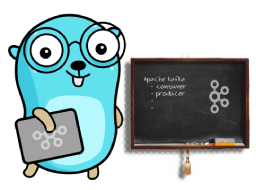

# hello-kafka

Target of this repository is to help gophers who are starting with Kafka Go implementations. 
This will update with consumer, producer examples of each recognized Go Kafka clients. 
Currently, we have followings clients and there different consumer and producer examples.

- ### [**Shopify/sarama**](https://github.com/Shopify/sarama)
    - [sync producer](https://github.com/senpathi/hello-kafka/blob/master/sarama/producer.go)
    - [partition consumer](https://github.com/senpathi/hello-kafka/blob/master/sarama/consumer.go)
    
- ### [**confluent-kafka-go**](https://github.com/confluentinc/confluent-kafka-go)
    - [sync producer](https://github.com/senpathi/hello-kafka/blob/master/confluent/producer.go)